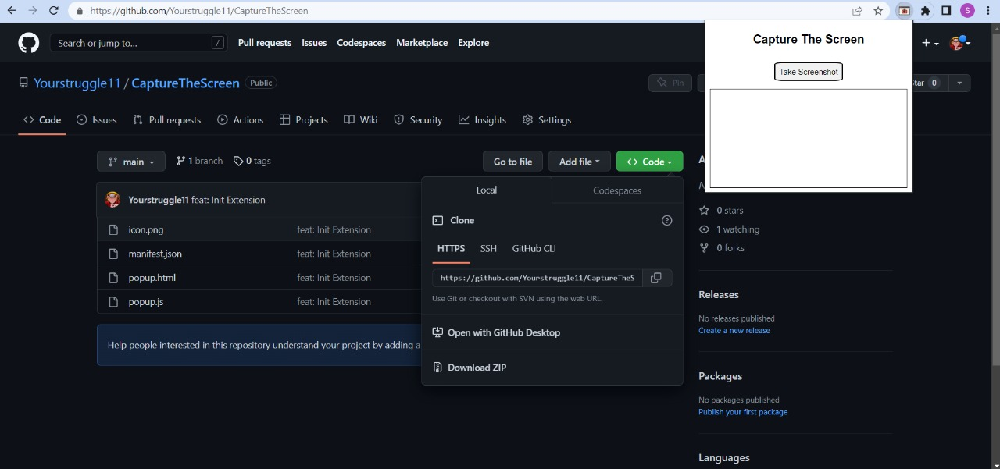
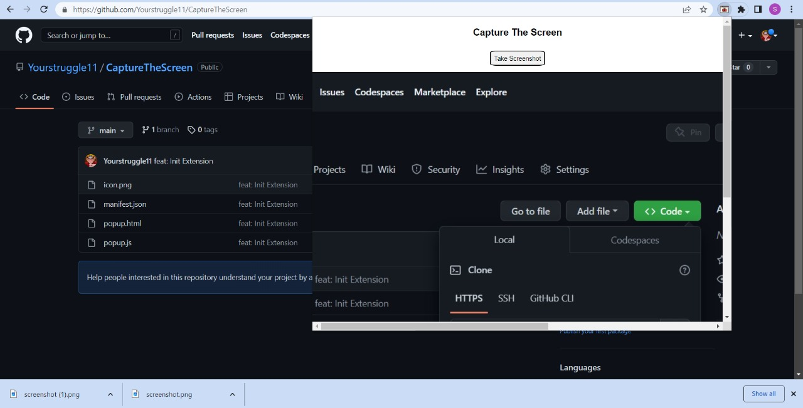
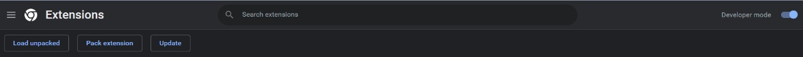

##  ***CaptureTheScreen*** Capture The Screen is a Chrome Extension to capture the screen of the current tab. It saves screenshots in PNG format and save it on your computer

<br />
<br />

# Preview


<br />
<br />


<br />
<br />

# Installation Guide


```js
git clone https://github.com/Yourstruggle11/CaptureTheScreen.git
```

```js
cd ./CaptureTheScreen
```


# Next

- Open Chrome Browser
- Go to [chrome://extensions/](chrome://extensions/)
- Toggle the top right button to enable Developer Mode.. (See the Screenshot below)

<br />

- Once Developer mode is enabled, click the **Load unpacked** button in the upper left corner.. (See the Screenshot below)

<br />

- Opload the CaptureTheScreen folder. That is all 👌


## ***Your Chrome Extension is all set***
<hr />

# You can now use this extension in the same way that you use other extensions.


## ***Feel free to copy anything, it's all yours***


## Thank You, Made with ❤️ by Souvik Sen